# Rokto Sondhan
Rokto Sondhan is an app for finding & donating Blood in emergency situations according to your location.

### What does this app do?
It is an open source Android application that allows people to search for Blood around their location.It also
provides emergency ambulence service,Reminds donor about his next donation.

### App Interface

  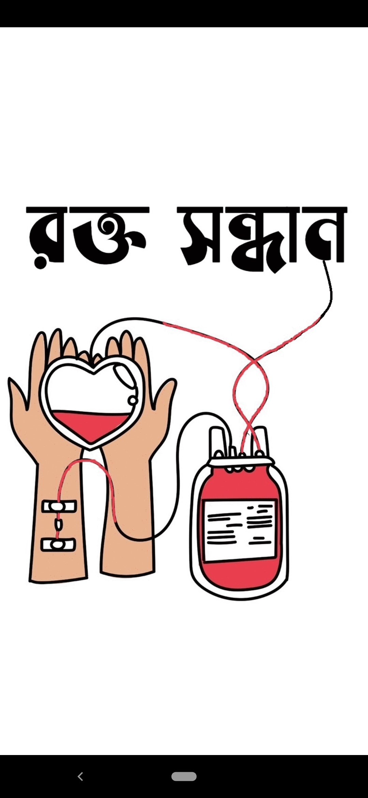
  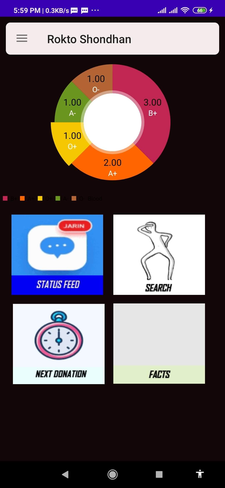 
  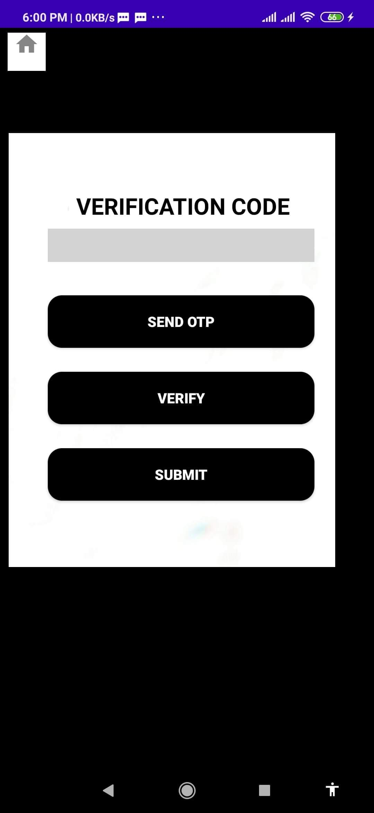

# Libraries this app uses:

1. Firebase - https://firebase.google.com/ 

# Setup

It is encouraged to use latest version of Andriod Studio (4.0 or above) & sdk version 29

1.  Clone or download this repo.
2. 	This app runs off a Firebase backend. You will need to generate your firebase backend. To do this, navigate to https://firebase.google.com/ and sign up. 
   Or follow the following steps:
   
   **Connection to Firebase**
   
  I.  Go to Tools -> Firebase
	
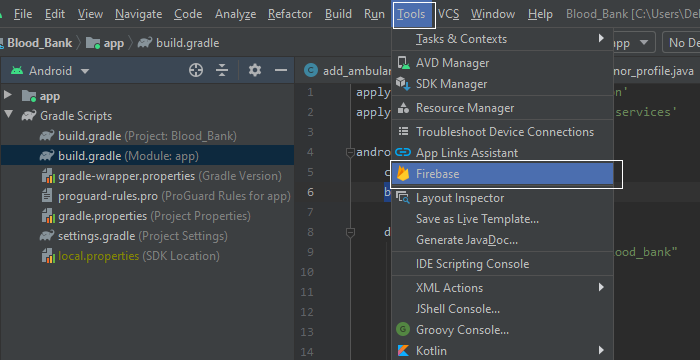
      II.  A firebase window will pop up.Go to Realtime Database. Now Connect to firebase.
      
 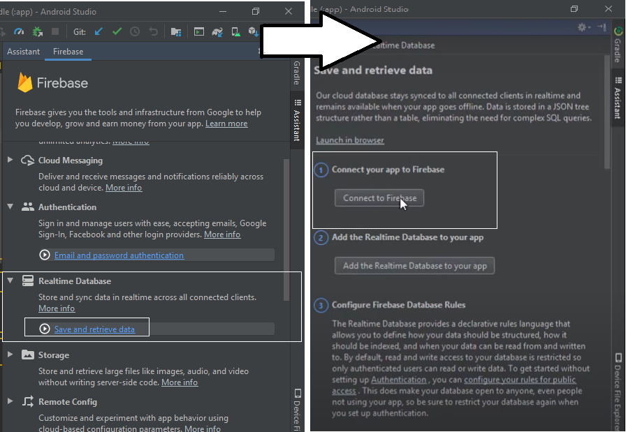
     III.  In your default browser Google Signin page will appear.USE_
     
     email:  developer.aust@gmail.com
  password:  developer@aust39
     
 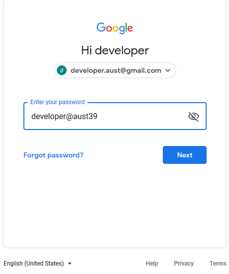

  IV.  Success message will be shown for signing in.
	
 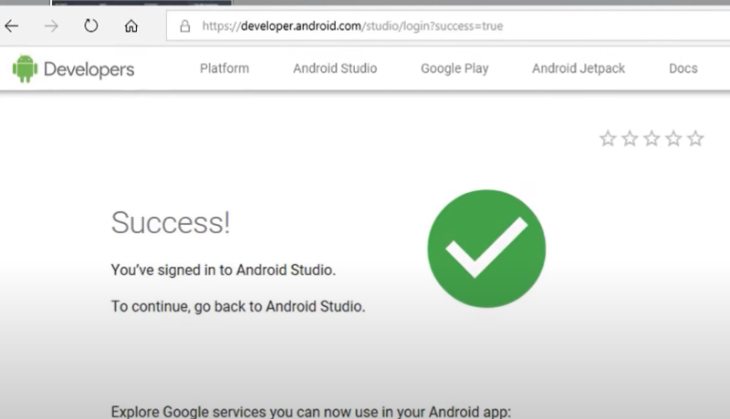
			 
  V. Now check Firebase is connected.You are good to go.
	
 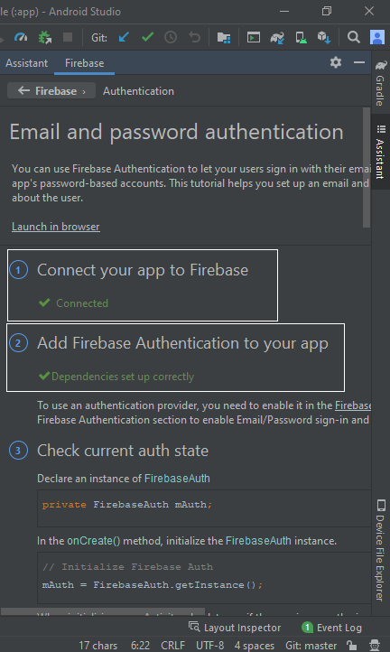

3. Go to **Files->Project Structure**. Look for Andriod Ndk Location. If its not downloaded,click download.

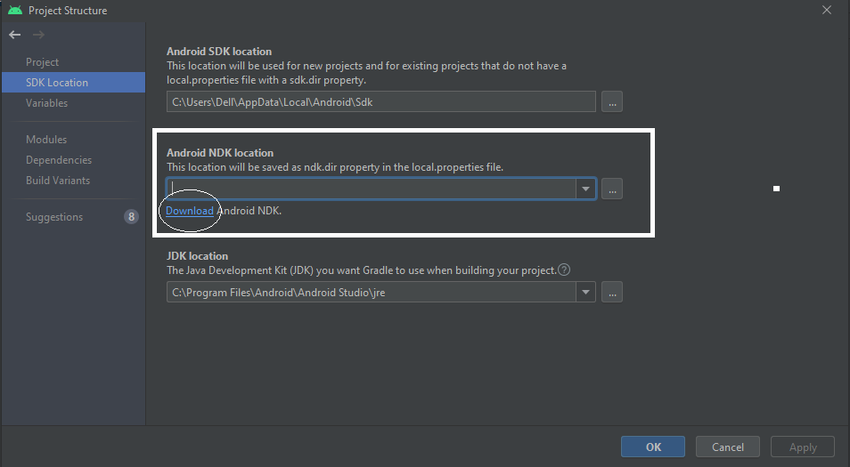

4. Now sync the project. Build & Run.It should be good to go.

# What if my andriod studio isn't upto date/ Showing error?
Only try this when its shows graddle/sync error due to SDK/ gradle compability.Ifupdaing sdk toools doesnt solve 
the problem,you have to follow given steps to run project successfuly.

1. First open the project directry.Delete gradle,gradlew files shown in the picture

 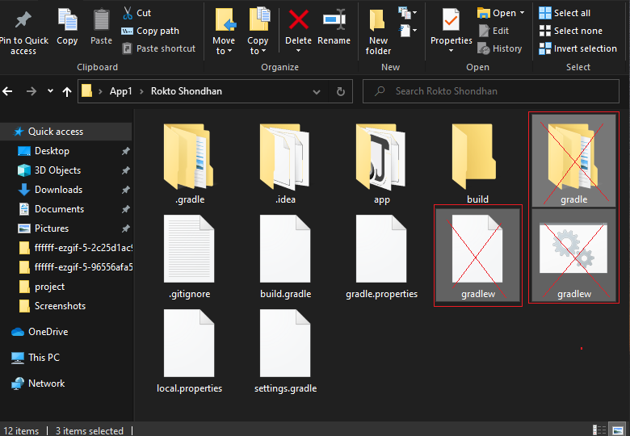
 
2. Now open any running application of Andriod Studio in your device.
  Check both build.gradle files for **tools.build:gradle,compileSdkVersion & buildToolsVersion.**
  The project you want to run must have same values.
	
  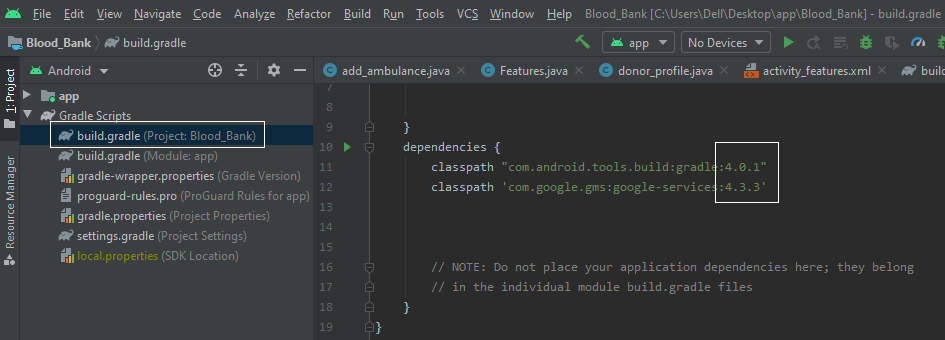 
  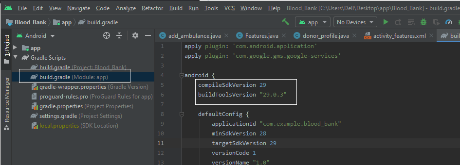
	
3. Now open the project directry again.Open **build.gradle** & another gradle filers from app folder(app-> build.gradle) with Nodepad++
  Edit the values of **tools.build:gradle,compileSdkVersion & buildToolsVersion** as your ruuning version.
	
 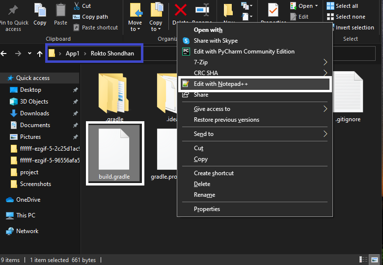
 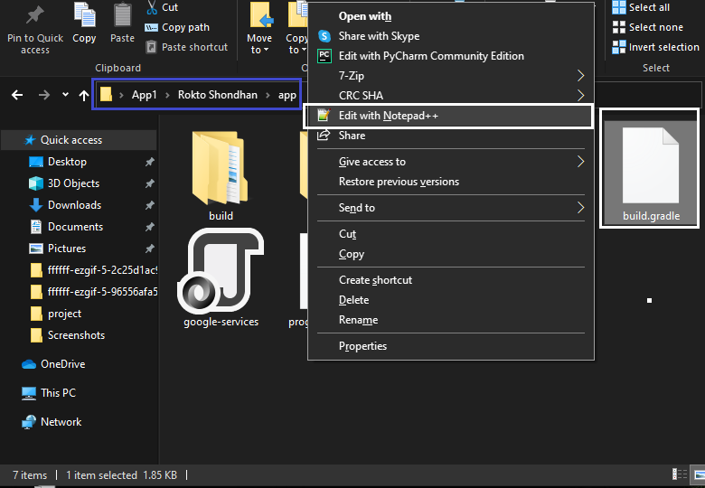
 
4.Now check NDK version is given or not. If not go to Project Structure. **File->Project Structure**.Here **ndk\21.2.6472646** is used

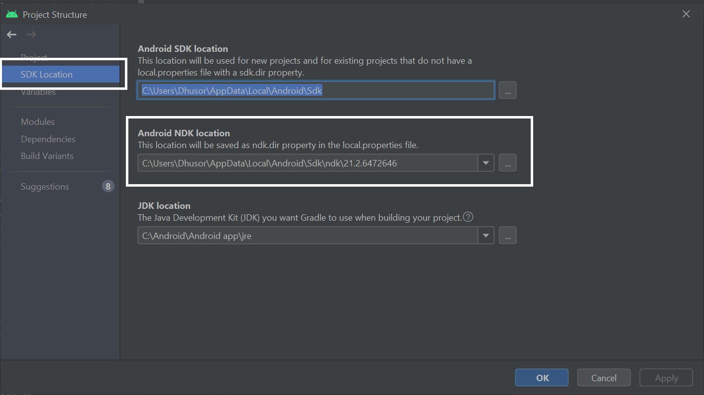

5. Now open the project in Andiod Studio.The problem should be solved. 

